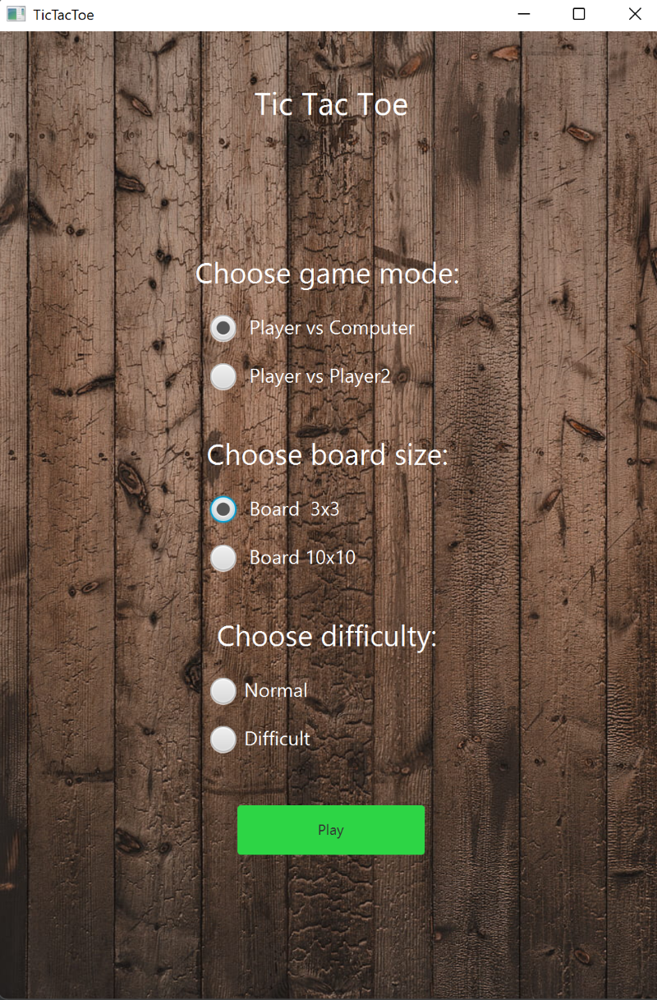

Welcome to TIC TAC TOE Game - my first fully self-made game.

It is a 2 player game. The first player is known as X and the second is O.
If You want, You can play with computer, od second player.

You can choose normal version 3x3, or extended version with 10x10 board.
--> In 3x3 version: Players play Xs and Os on the game board. 3 signs in line - win.
--> In 10x10 version: 5 signs in line - victory.

Have Fun!

Author: GG
